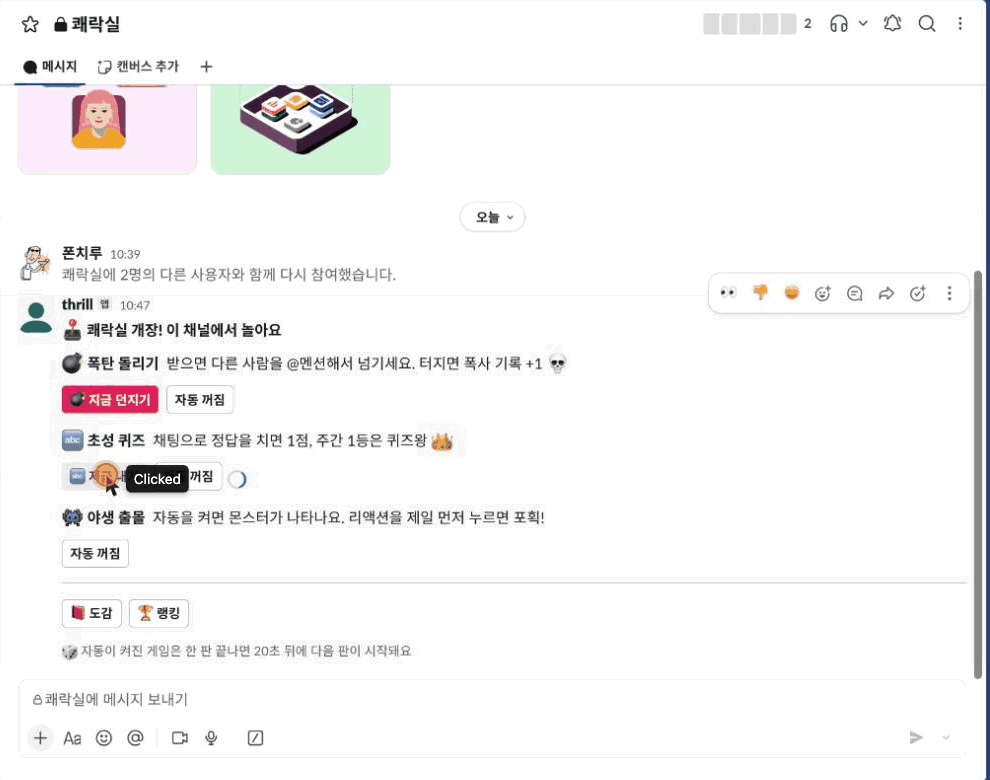

# Kwaeraksil (쾌락실)

[한국어](README.md) · **English**

[](LICENSE)   

A Slack bot for playing mini-games with friends right in your channel. The name is a pun on 오락실 (arcade) and 쾌락 (pleasure) — roughly "the thrill room".



> The bot speaks Korean. The chosung quiz in particular is a Korean word game, so it's most fun with Korean-speaking friends.

| Game | Rules |
| --- | --- |
| 💣 Hot Potato Bomb | A bomb lands on someone who chatted in the last hour. @mention someone else to pass it on. It explodes after 1–5 minutes, and whoever's holding it goes on the ranking's "most blown up" list 💀 |
| 👾 Wild Encounter | Turn on auto mode and emoji monsters start showing up. The first person to react catches it; if nobody does within a minute, it runs away. 18 common · 10 rare · 3 legendary, 31 species in total |
| 🔤 Chosung Quiz | You get the initial consonants (초성) of a Korean lunch menu, e.g. `ㄸㅂㅇ` → 떡볶이. Type the answer in chat within 3 minutes for 1 point. This week's top scorer is the Quiz King 👑 |
| 🎲 Auto Mode | Toggle it per game. A game with auto mode on starts its next round 20 seconds after the last one ends |
| 🔁 Monster Trading | Swap a caught monster 1:1 with a friend's. The offer is posted to the channel and the swap happens as soon as they accept. Trading duplicates for new species moves you up the collection ranking |

## How to play

Type `/game` in a channel. That channel becomes the game channel and the menu shows up. Auto mode starts off, so turn on only the games you want.

- **💣 지금 던지기** (throw now) · **🔤 지금 내기** (ask now) — start a round right away
- **도감** (collection) · **랭킹** (ranking) — visible only to whoever pressed it
- **🔁 교환** (trade) — pick a monster to give, a friend, and the monster you want, and a trade offer is posted to the channel
- **자동 켜짐 / 꺼짐** (auto on / off) — sits next to each game. Each press toggles it, and it turns green when on

A quiz also pops up once a day at noon, whether auto mode is on or not. The bot's **App Home** tab shows your own collection (❔ for empty slots, ×2 for duplicates).

## Setup

### Requirements

All you need is **Node 24 or later**. It runs on macOS, Windows, and Linux (it uses the SQLite built into Node, so there's no database to install). It connects to Slack over Socket Mode, so you don't need a public URL or open ports either.

| OS | Install Node and pnpm |
| --- | --- |
| macOS | `brew install node pnpm` |
| Windows | `winget install OpenJS.NodeJS pnpm.pnpm` |
| Linux | Install Node 24 following [nodejs.org](https://nodejs.org), then `npm install -g pnpm` |

Afterwards, check that `node -v` prints `v24` or higher. You can use npm instead of pnpm (`npm install` · `npm start`).

### Run the bot

1. Get the code

   ```bash
   git clone https://github.com/E-JIWON/slack-thrill-bot.git
   cd slack-thrill-bot
   pnpm install
   ```

2. At [api.slack.com/apps](https://api.slack.com/apps), choose **Create New App → From a manifest** and paste in the contents of `manifest.yml`
3. Under **Basic Information → App-Level Tokens**, create an app token (`xapp-`) with the `connections:write` scope
4. Install the app to your workspace via **Install App** and copy the bot token (`xoxb-`)
5. Copy `.env.example` to `.env`, fill in both tokens, and start it

   ```bash
   pnpm start
   ```

6. In the channel you want to play in, invite the bot with `/invite @thrill` and type `/game`

## Multiple workspaces

Create one Slack app per workspace, each with its own `.env` file. Set a different save file name with `DB=` so the records don't get mixed up.

```bash
node --env-file=.env.second index.js
```

## Good to know

- The bot only runs **while the computer it's on stays awake**. If the computer shuts down or goes to sleep, so does the bot. An always-on machine (like a Mac mini) or a server works best
- It won't work on serverless platforms that only wake up per request (Vercel, Firebase Functions, etc.), because the timers and the persistent connection get cut off
- Collections, scores, and explosion records are kept in the save file (`*.db`), but any bomb, quiz, or monster in progress is lost when the bot stops
- The bot has to be invited to a channel before it can post there or read the chat
- The noon quiz follows the clock of the computer running the bot
